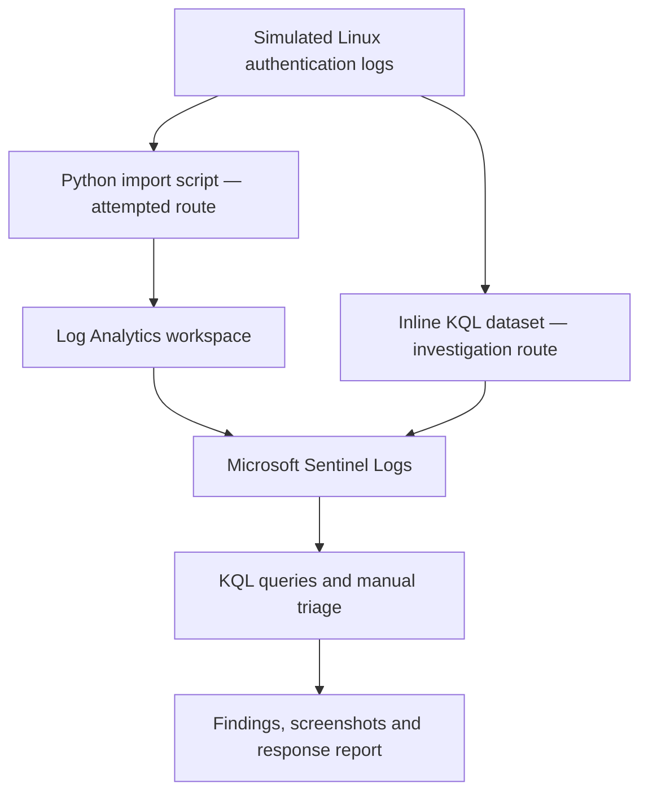

# Microsoft Sentinel | SSH Detection and Investigation


An investigation of simulated Linux authentication activity using Microsoft Sentinel and Kusto Query Language (KQL). This project demonstrates identifying suspicious login patterns, evaluating evidence and documenting response recommendations.

[View the Investigation Report with Screenshot Evidence (PDF)](Microsoft-Sentinel-SOC-Report.pdf)

## Project Overview

Meridian Trust Bank, a fictional organisation, provided server logs containing suspicious authentication activity. I investigated the records to distinguish potential compromise, unsuccessful attack attempts and service-account errors.

The analysis identified three sources requiring investigation. The highest-priority finding involved repeated authentication failures followed by successful access to an administrative account.

**Skills demonstrated:** Microsoft Sentinel configuration, KQL, authentication-log analysis, security triage, evidence interpretation and technical reporting.

## Key Findings

| Source IP | Observed Activity | Assessment |
|---|---|---|
| `203.0.113.77` | 14 failed logins followed by successful authentication to `opsadmin` | Compromise within the training scenario; priority escalation |
| `10.20.14.9` | 30 failures against `svc-backup` at regular intervals | Exercise identifies an outdated backup credential; service-owner verification would be required in production |
| `198.51.100.23` | 11 failures against 11 distinct usernames | Suspected password spraying; no successful authentication observed from this source in the sample |

Further examination of the original logs identified a subsequent privileged command targeting `/etc/shadow`. This supports investigation of possible credential exposure; the available evidence does not establish successful exfiltration.

Screenshots supporting the findings are included in the [investigation report](Microsoft-Sentinel-SOC-Report.pdf).

## Architecture



The Python ingestion route was attempted. The documented investigation used the supplied inline KQL dataset after a custom-table query returned zero records.

## Environment and Log Sources

| Component | Purpose |
|---|---|
| Azure resource group | Organises the project resources |
| Log Analytics workspace | Workspace connected to Microsoft Sentinel |
| Microsoft Sentinel | Security investigation and analytics platform |
| `meridian_auth.log` | Simulated Linux authentication, session, sudo and scheduled-job records |
| `MeridianLogs` | Inline KQL datatable used for the documented analysis |
| `MeridianLogs_CL` | Intended destination for imported records; successful ingestion remains unverified |

### Dataset

| Record Category | Count |
|---|---:|
| Failed-password events | 68 |
| Accepted-password events | 50 |
| Other records | 173 |
| **Total** | **291** |

Original timestamps span **20 July, 06:17:00 to 22 July, 05:17:00**. The source lines do not specify the year or timezone.

## Build Steps

1. Created the Azure resource group `rg-meridian-soc`.
2. Created the Log Analytics workspace `law-meridian-soc1`.
3. Enabled Microsoft Sentinel for the workspace.
4. Uploaded the Python importer and authentication log to Azure Cloud Shell.
5. Corrected uploaded-filename errors and attempted ingestion.
6. Used the supplied fallback dataset to continue the investigation.
7. Filtered authentication failures and extracted source IP addresses.
8. Compared failure counts, targeted accounts and authentication outcomes.
9. Reviewed related privileged activity.
10. Documented findings, screenshots, response recommendations and limitations.

## Detection Logic

The exploratory query identifies sources generating more than five failed SSH logins across the supplied sample.

```kql
// Run after the supplied MeridianLogs datatable definition.
// Counts cover the complete sample, not a ten-minute window.
MeridianLogs
| where RawData_s contains "Failed password"
| extend SourceIP = extract(@"from ([0-9.]+)", 1, RawData_s)
| where isnotempty(SourceIP)
| summarize FailedAttempts = count() by SourceIP
| where FailedAttempts > 5
| order by FailedAttempts desc
```

### What the Query Does

1. Selects failed-password records.
2. Extracts the source IP from each message.
3. Removes records without an extracted address.
4. Counts failures per source.
5. Returns sources exceeding the threshold.

A threshold match identifies a candidate for investigation. It does not independently establish malicious intent or successful compromise.

This query does not automatically generate Sentinel alerts or incidents. Those require a configured analytics rule and incident settings.

## Saved KQL Queries

| Query | Purpose |
|---|---|
| [Failed-login threshold](queries/01_failed_login_threshold.kql) | Identifies sources exceeding the failure threshold |
| [Source investigation](queries/02_triage_source.kql) | Examines authentication outcomes for a selected source |
| [Privileged activity](queries/03_privileged_activity.kql) | Searches account-related activity that IP-only filtering may miss |
| [Workbook source totals](queries/04_workbook_top_sources_inline.kql) | Prepares failure counts for a bar chart |
| [Workbook timeline](queries/05_workbook_event_timeline_inline.kql) | Groups failures by original event time |
| [Proposed scheduled detection](queries/06_lab_scheduled_rule_candidate.kql) | Applies a time-based threshold to imported data |
| [Ingestion validation](queries/07_verify_ingestion.kql) | Checks imported-table availability and schema |

Queries 01–03 require the supplied `MeridianLogs` datatable definition. Queries 04–05 include that definition. Queries 06–07 require the imported table.

The proposed scheduled detection and workbook queries require validation in Azure before being described as implemented.

## Investigation Approach

For each source, I examined:

- The targeted account or accounts.
- The number and timing of authentication failures.
- Whether successful authentication followed the failures.
- Related account and host activity.
- Available operational context and alternative explanations.

The backup service generated the highest failure count, while the successful-login sequence warranted greater urgency. This demonstrated why volume must be assessed alongside outcomes and context.

The available screenshots document manual queries and investigation results, not generated Sentinel incident records.

## Recommended Response

| Finding | Recommended Action |
|---|---|
| Successful access after repeated failures | Escalate, preserve evidence, investigate subsequent activity and assess authorised account and host containment |
| Backup service authentication failures | Verify the service and credential history, correct the credential and confirm successful backup operation |
| Suspected password spraying | Review targeted accounts, search other systems for related activity and monitor for subsequent successful access |

These actions are recommendations. Containment and remediation were not executed during this documented exercise.

## Detection Limitations

- The demonstrated threshold counts the entire sample rather than a defined time window.
- Source-IP thresholds can miss slow or distributed attempts.
- Service-account errors can resemble malicious authentication activity.
- IP-only searches can omit relevant session and privileged-command records.
- Successful authentication alone does not establish the full impact of an incident.
- Missing year and timezone information requires documented assumptions when plotting event times.

## What I Would Do in Production

- Verify reliable log collection and monitor ingestion gaps.
- Distinguish original event time from collection time.
- Test scheduled detections against malicious and expected activity.
- Correlate authentication records with endpoint and network telemetry.
- Add account-focused detections for slow and distributed attempts.
- Apply narrowly scoped exceptions after validating service behaviour.
- Test alert creation, entity mapping, incident ownership and escalation.
- Document authorised containment, recovery and follow-up actions.

## Implementation Status

| Capability | Status |
|---|---|
| Azure and Sentinel setup | Documented |
| Manual KQL analysis of the fallback dataset | Documented |
| Investigation findings and response recommendations | Documented |
| Persistent custom-table ingestion | Not yet verified |
| Scheduled analytics rule and generated alerts | Not yet verified |
| Incident-queue investigation | Not yet verified |
| Saved workbook dashboard | Not yet verified |
| Containment and remediation | Recommended, not executed |

## Investigation Report

The report includes the investigation summary, detection logic, source-by-source assessments, screenshot evidence, MITRE ATT&CK mappings, recommended responses and detection limitations.

**[Open the SOC Investigation Report with Screenshot Evidence (PDF)](Microsoft-Sentinel-SOC-Report.pdf)**

## Lessons Learned

The source with the most failures was not the highest-priority finding. Authentication outcomes, timing and operational context were needed to assess each case.

Correlating the account, host and time provided a more complete investigation than source-IP filtering alone.

Accurate reporting required separating observed evidence, scenario context, analyst interpretation and proposed response actions.


